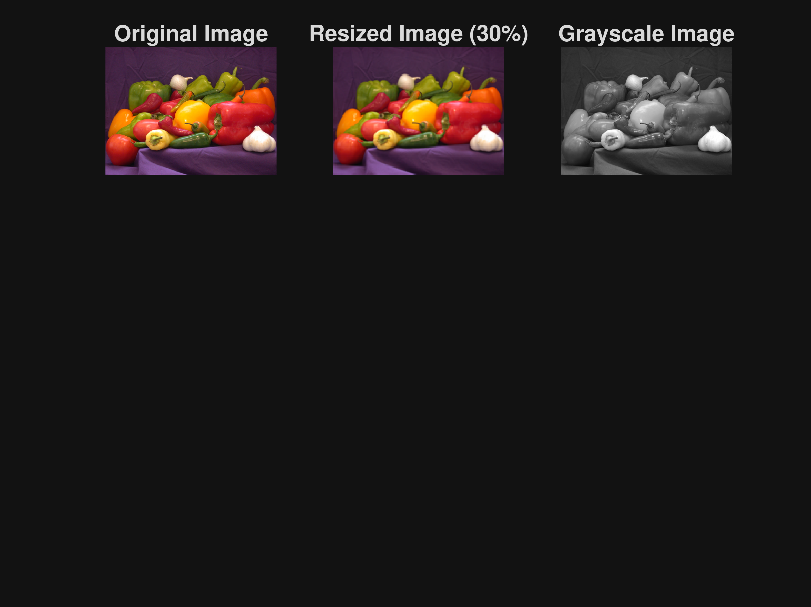
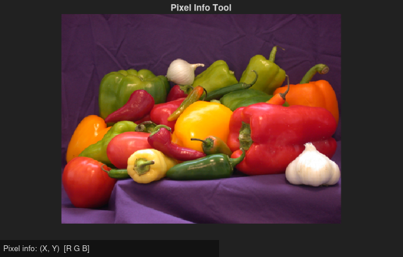
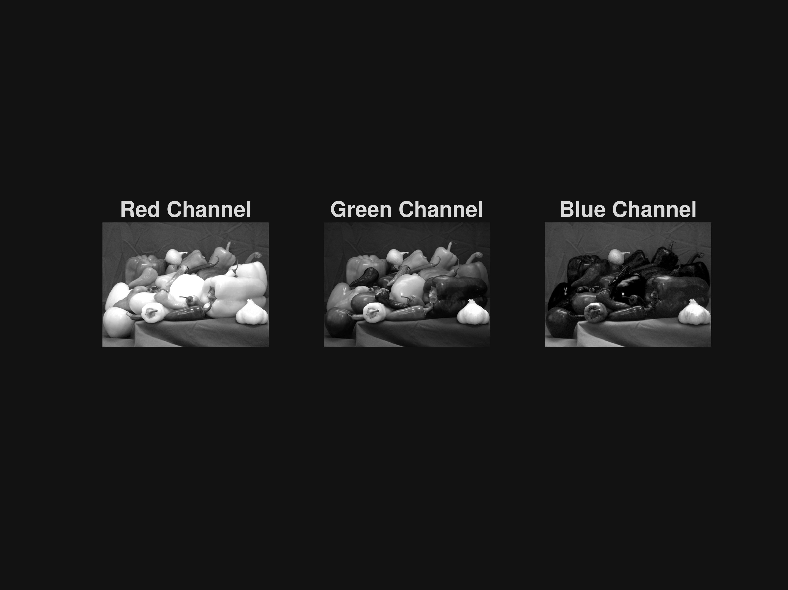
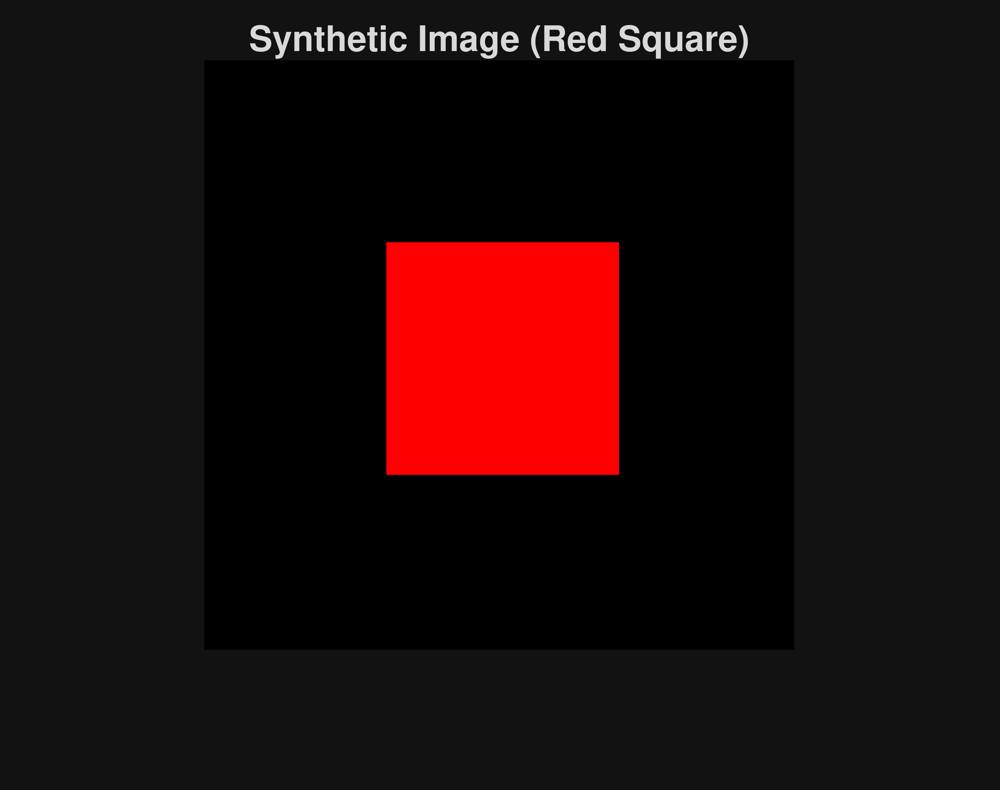
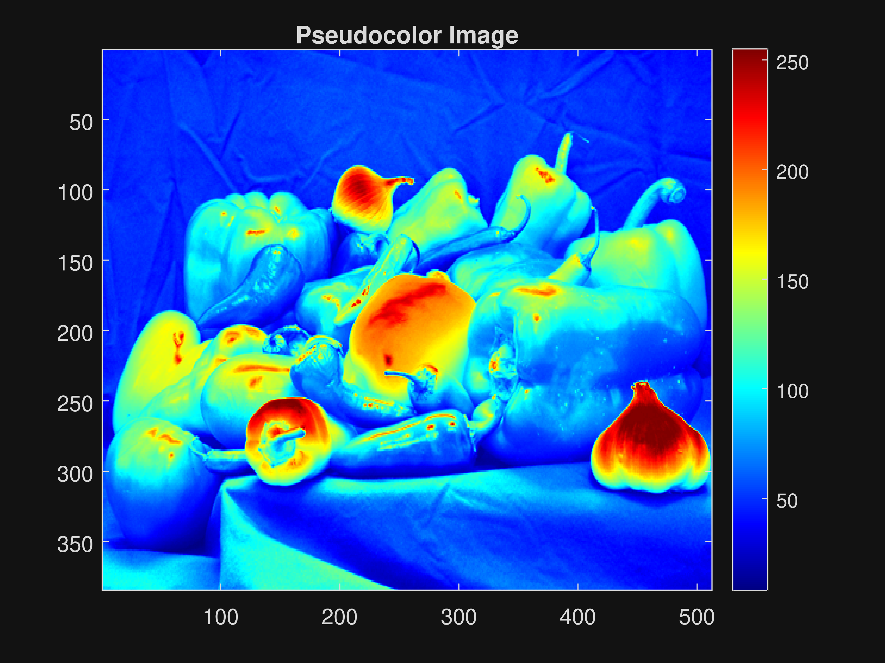

```matlab
%% IMAGE PROCESSING BASICS IN MATLAB
% Topics:
% 1. Image resize
% 2. Color band extraction
% 3. Type conversion
% 4. Pixel information
% 5. Synthetic image creation
% 6. Pseudocolor image

clc;
clear;
close all;

%% Step 1: Read Image
img = imread('peppers.png');

figure('Name', 'Image Processing Basics', 'NumberTitle', 'off');

subplot(3, 3, 1);
imshow(img);
title('Original Image');

%% Step 2: Image Resize
img_resize = imresize(img, 0.3);   % Resize to 30%
subplot(3, 3, 2);
imshow(img_resize);
title('Resized Image (30%)');

%% Step 3: Convert to Grayscale
img_gray = rgb2gray(img);
subplot(3, 3, 3);
imshow(img_gray);
title('Grayscale Image');
```



```matlab

%% Step 4: Image Type Conversion
img_double = im2double(img_gray);
disp('First 5 pixel values (double format):');
```

```matlabTextOutput
First 5 pixel values (double format):
```

```matlab
disp(img_double(1, 1:5));
```

```matlabTextOutput
    0.1686    0.1725    0.1804    0.1725    0.1647
```

```matlab

%% Step 5: Pixel Information Tool
figure;
imshow(img);
title('Pixel Info Tool');
impixelinfo;
```



```matlab

%% Step 6: Extraction of Color Bands (RGB Channels)
R = img(:, :, 1);
G = img(:, :, 2);
B = img(:, :, 3);

figure('Name', 'RGB Color Channels', 'NumberTitle', 'off');

subplot(1, 3, 1);
imshow(R);
title('Red Channel');

subplot(1, 3, 2);
imshow(G);
title('Green Channel');

subplot(1, 3, 3);
imshow(B);
title('Blue Channel');
```



```matlabTextOutput
Warning: An error occurred while drawing the scene: GraphicsView error in command: controlmanagermessage:  _setupStrategy@https://matlab-2b.mathworks.com/toolbox/matlab/uitools/figurelibjs/release/bundle.mwBundle.gbtfigure-lib.js?mre=https
```

```matlab

%% Step 7: Create a Synthetic Image
S_img = zeros(256, 256, 3, 'uint8');   % Black RGB image

% Create a colored square (red)
S_img(80:180, 80:180, 1) = 255;   % Red channel
S_img(80:180, 80:180, 2) = 0;     % Green channel
S_img(80:180, 80:180, 3) = 0;     % Blue channel

figure;
imshow(S_img);
title('Synthetic Image (Red Square)');
```



```matlab

%% Step 8: Pseudocolor Image
figure;
imagesc(img_gray);     % Display grayscale with colors
colormap(jet);         % Apply pseudocolor map
colorbar;
title('Pseudocolor Image');
```




