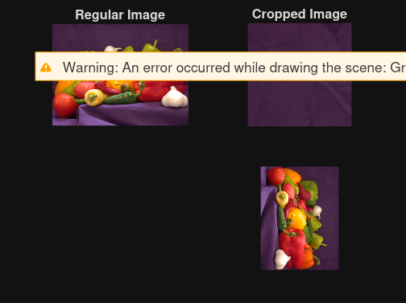

```matlab
%clear previous saved cache
clc;
clear all;
close all;
```

```matlab
% display normal and cropped image
img = imread('peppers.png');
subplot(2, 2, 1);
imshow(img);
title('Regular Image');

cropped = imcrop(img, [0, 0, 100, 100]);
subplot(2, 2, 2);
imshow(cropped);
title('Cropped Image');

rotate = imrotate(img, -90);
subplot(2, 2, 4);
imshow(rotate);
```



```matlab

% add sub mul div on a given img
```

```matlab
a = imread('whit.png')
```
